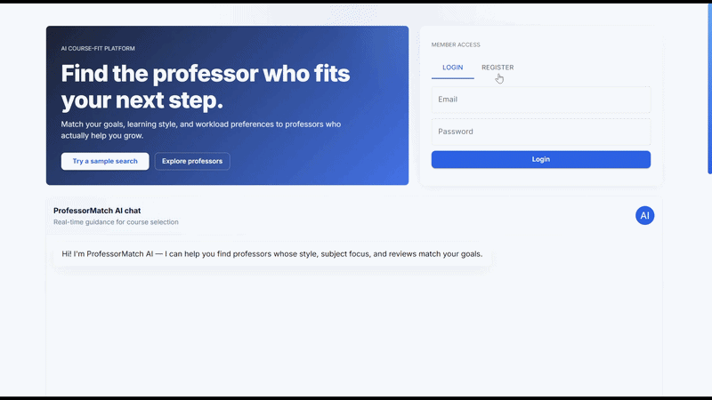
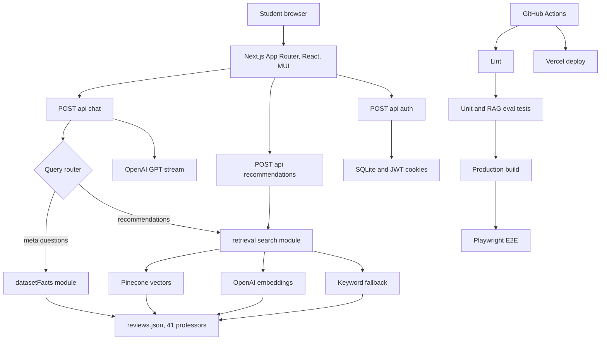

# ProfessorMatch AI

**Live demo:** [professor-match-ai.vercel.app](https://professor-match-ai.vercel.app) · **Repo:** [RateMyProfessor-RAG](https://github.com/Arlikhozhaev/RateMyProfessor-RAG)

ProfessorMatch AI is a full-stack professor recommendation platform that turns unstructured course reviews into conversational, grounded search. Students ask natural-language questions; the system retrieves relevant profiles from a 41-record dataset, ranks matches with explainable scores, and streams LLM answers anchored to real review data.



## Highlights

Built to demonstrate production-minded full-stack and ML systems engineering — not a toy chatbot wrapper.

| Outcome | Measured by | How |
|--------|-------------|-----|
| **Reliable retrieval at scale** | 3-tier fallback across 41 indexed professors | Pinecone vector search → OpenAI semantic embeddings → local keyword matching, so recommendations still work when external APIs are unavailable |
| **Factual answers on dataset questions** | 100% deterministic routing for meta-queries | Query router sends counts, duplicate subjects, and name-collision questions to `datasetFacts.js`, bypassing the LLM for grounded facts |
| **Shippable quality bar** | 56 automated tests across 4 layers | Vitest unit tests, 20-case golden RAG eval, API integration suite, and Playwright E2E — all gated in GitHub Actions on every push/PR |
| **Complete product surface** | 41 pre-rendered profile routes + live chat | Next.js App Router UI with streaming GPT-4o-mini responses, JWT auth, analytics, rate limiting, and Vercel CD deploy |

## Overview

**Problem:** Students planning courses waste time scanning unstructured reviews with no way to match teaching style, workload, or subject fit to their goals.

**Solution:** A hybrid RAG architecture that grounds every AI response in curated data (`reviews.json`). Retrieval ranks professors by relevance; chat explains tradeoffs in plain language; profile pages deep-link back into the assistant for follow-up questions.

**Engineering decisions worth noting:**

- **Graceful degradation** — vector and semantic paths fail open to keyword search instead of breaking the UX
- **Query routing** — separates recommendation retrieval from deterministic dataset logic, reducing hallucination risk on factual questions
- **Session persistence** — chat history survives navigation between home and professor profiles via `sessionStorage`
- **Serverless-aware auth** — JWT session restore when SQLite rows are missing across Vercel instances

## Architecture



## Core Features

- **Hybrid RAG retrieval** — Pinecone vector search → OpenAI semantic embeddings → keyword fallback
- **Deterministic dataset answers** — accurate counts, duplicate subjects, and filtered totals without LLM guesswork
- **41 static professor profiles** at `/professor/[slug]` with related recommendations and chat deep links
- **Streaming AI assistant** — markdown responses via GPT-4o-mini with retrieved context
- **Auth & observability** — bcrypt password hashing, HTTP-only JWT cookies, query/engagement analytics, API rate limiting
- **CI/CD pipeline** — lint → 56 tests → production build → Playwright E2E → Vercel deploy

## Project Structure

| Path | Purpose |
|------|---------|
| `app/` | Pages and API routes |
| `app/professor/[slug]/` | Static professor profile pages (41 SSG routes) |
| `lib/retrieval/` | Hybrid RAG search pipeline |
| `lib/datasetFacts.js` | Deterministic answers for meta/dataset questions |
| `lib/chatSession.js` | Client-side chat persistence across navigation |
| `components/` | UI (chat, auth, recommendations, layout) |
| `hooks/` | Client hooks (`useChat`, `useAuth`, `useChatAutoScroll`) |
| `tests/unit/` | Vitest unit tests |
| `tests/rag-eval/` | Golden retrieval query eval set (20 cases) |
| `tests/integration/` | API route integration tests |
| `tests/e2e/` | Playwright browser tests |
| `reviews.json` | Curated professor dataset (41 records) |

## Getting Started

```bash
npm install
npm run db:init
npm run dev
```

Open [http://localhost:3000](http://localhost:3000).

## Testing

```bash
npm run test:unit          # 56 tests — unit + RAG eval + API integration
npm run test:rag-eval      # 20 golden retrieval queries
npm run test:integration   # Auth, recommendations, and chat API routes
npm run test:e2e:setup     # First time — install Playwright Chromium
npm run build              # Required before E2E
npm run test:e2e           # Browser tests (port 3001)
npm run lint
```

CI runs on every push and pull request via GitHub Actions, with Vercel deployment on merge to `main`.

## Environment Variables

Copy `.env.example` to `.env.local` and configure as needed:

| Variable | Required | Purpose |
|----------|----------|---------|
| `AUTH_SECRET` | Production | JWT session signing |
| `OPENAI_API_KEY` | Optional | GPT streaming + semantic retrieval |
| `PINECONE_API_KEY` | Optional | Vector search |
| `PINECONE_INDEX` | Optional | Default: `rag` |
| `PINECONE_NAMESPACE` | Optional | Default: `ns1` |
| `DB_PATH` | Optional | SQLite file location |

Re-run `load.ipynb` (cells 1, 3, 4, 6, 7) after editing `reviews.json` if using Pinecone.

## Deployment

**Vercel (recommended):** import the GitHub repo, set env vars, deploy.

Production notes:

- Set `AUTH_SECRET` to a long random string
- SQLite works on Node server runtimes; swap to a hosted DB for multi-instance scale
- Pinecone index should contain **41 vectors** matching `reviews.json`

## Tech Stack

Next.js 14 · React · MUI · Node.js · SQLite · OpenAI · Pinecone · Vitest · Playwright · GitHub Actions · Vercel

## License

Educational and demonstration purposes.
