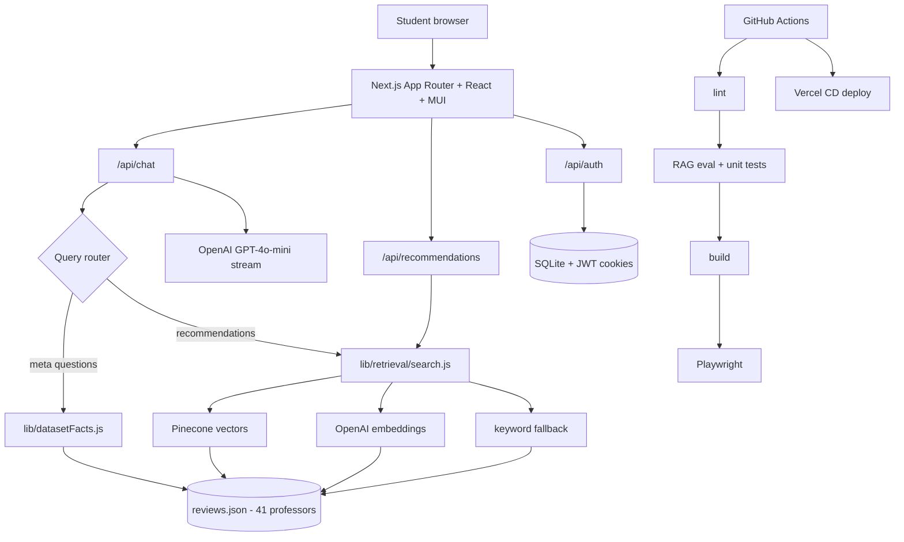

# ProfessorMatch AI

**Live demo:** [professor-match-ai.vercel.app](https://professor-match-ai.vercel.app) · **Repo:** [RateMyProfessor-RAG](https://github.com/Arlikhozhaev/RateMyProfessor-RAG)

An AI-powered professor recommendation platform built with Next.js, hybrid RAG retrieval, and a conversational assistant grounded in curated review data.


## Overview

ProfessorMatch AI helps students discover professors using:

- hybrid retrieval (Pinecone → semantic embeddings → keyword fallback),
- streaming chat with markdown responses,
- recommendation cards with match scores,
- static professor profile pages,
- auth, analytics, rate limiting, and automated CI/CD.

## Architecture



## Core Features

- **Hybrid RAG retrieval** — Pinecone vector search → OpenAI semantic embeddings → keyword fallback
- **Deterministic dataset answers** — accurate counts, duplicate subjects, and filtered totals
- **Professor profile pages** at `/professor/[slug]` with related recommendations
- **AI chat assistant** with markdown responses and streaming
- **User authentication** with session cookies and secure password hashing
- **Analytics tracking** for queries and engagement events
- **Automated quality gates** — unit tests, RAG eval, API integration tests, Playwright E2E, GitHub Actions CI/CD

## Project Structure

| Path | Purpose |
|------|---------|
| `app/` | Pages and API routes |
| `app/professor/[slug]/` | Static professor profile pages (41 routes) |
| `lib/retrieval/` | Hybrid RAG search pipeline |
| `lib/datasetFacts.js` | Deterministic answers for meta/dataset questions |
| `components/` | UI (chat, auth, recommendations, layout) |
| `hooks/` | Client hooks (`useChat`, `useAuth`, `useChatAutoScroll`) |
| `tests/unit/` | Vitest unit tests |
| `tests/rag-eval/` | Golden retrieval query eval set (20 cases) |
| `tests/integration/` | API route integration tests |
| `tests/e2e/` | Playwright browser tests |
| `reviews.json` | Curated professor dataset (41 records) |

## Getting Started

```bash
npm install
npm run db:init
npm run dev
```

Open [http://localhost:3000](http://localhost:3000).

## Testing

```bash
npm run test:unit          # Unit + RAG eval + API integration tests
npm run test:rag-eval      # Golden retrieval queries only
npm run test:integration   # API route tests only
npm run test:e2e:setup     # First time — install Playwright Chromium
npm run build              # Required before E2E
npm run test:e2e           # Browser tests (port 3001)
npm run lint
```

CI runs on every push and pull request via GitHub Actions, with Vercel deployment on merge.

## Environment Variables

Copy `.env.example` to `.env.local` and configure as needed:

| Variable | Required | Purpose |
|----------|----------|---------|
| `AUTH_SECRET` | Production | JWT session signing |
| `OPENAI_API_KEY` | Optional | GPT streaming + semantic retrieval |
| `PINECONE_API_KEY` | Optional | Vector search |
| `PINECONE_INDEX` | Optional | Default: `rag` |
| `PINECONE_NAMESPACE` | Optional | Default: `ns1` |
| `DB_PATH` | Optional | SQLite file location |

Re-run `load.ipynb` (cells 1, 3, 4, 6, 7) after editing `reviews.json` if using Pinecone.

## Deployment

**Vercel (recommended):** import the GitHub repo, set env vars, deploy.

Production notes:

- Set `AUTH_SECRET` to a long random string
- SQLite works on Node server runtimes; swap to a hosted DB for multi-instance scale
- Pinecone index should contain **41 vectors** matching `reviews.json`

## Tech Stack

Next.js 14 · React · MUI · Node.js · SQLite · OpenAI · Pinecone · Vitest · Playwright · GitHub Actions · Vercel

## License

Educational and demonstration purposes.
